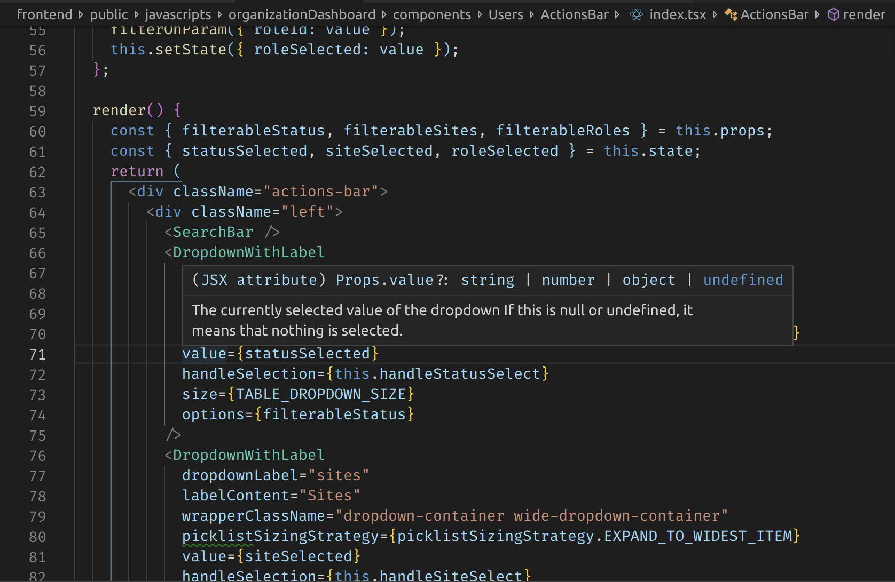
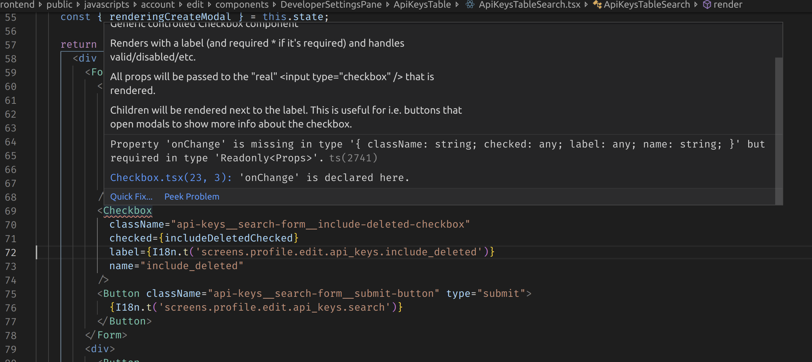

# Lessons learned and recommended practices

## Recommendations

### Avoid `any`
 Casting something to `any` has several pitfalls and should be avoided in general.

 Once something is cast as `any` TypeScript safety for code interacting with the `any` object is gone.

### Types and jsdocs integration

Using types in conjuction with JSDocs brings rich documentation with types into most IDEs.

Snippet from [Org Dashboard `types.ts`](https://github.com/socrata/platform-ui/blob/08bb04425e13680ae95fe3a7e8011dbb49960010/frontend/public/javascripts/organizationDashboard/types.ts#L6-L22):
```ts
export interface SearchParameters {
  limit: number;

  /** The status of the users we wish to fetch */
  status?: Status;

  /** The column to sort by */
  sortBy: string;

  sortOrder: 'ASC' | 'DESC';

  /** Email of last user on the previous page. Used for paging */
  seekEmail?: string;

  /** query string for partial text search by user name and email */
  q?: string | null;

  /** Site filter */
  domainCname?: string | null;
  
  /** Role ID to filter by */
  roleId?: number | null;

  /** Count the total number of users. Not limited by limit. */
  includeCount?: boolean;
}
```

Performing the above allows your IDE to pull the types with their definitions to be references across the code. JSDoc features intergrate seamlessly with the TS type system.


_Example of hovering over `value` for the `DropdownWithLabel` component in Visual Studio Code_

### selectors and return types

Selectors like most functions should have explicit return types.

Certain pieces of code have additional benefits to writing the return type explicitily. This allows the user to tests the typescripts implicit return type and avoid errors and write down assumptions that the TypeScript might miss. 

```typescript
export const getOrg = (state: ApplicationState): Organization | {} => get(state, 'organization', {});

export const getUsers = (state: ApplicationState): Users => get(state, 'users', defaultUserState);

export const getSites = (state: ApplicationState): Domain[] => get(getOrg(state), 'domains', []);

export const getRolesList = (state: ApplicationState): Role[] => get(getOrg(state), 'userRoles', []);
```

### Getting resources and setting return type

Explicitly casting the type of a returned ressources allows us to avoid a class of errors by removing an implicit any.

```typescript
    // fetch will return an `any` type that you can cast to the type you expect
    const payload: {data: Data, error: Error} = await fetchAndParseStream('https://www.website.com/some/api'); 

    // or....

    interface MyInterface {
        whatever: string;
    }
    
    const result = await fetchAndParseStream('https://www.website.com/some/api') as MyInterface;
```

We can also look into using libraries to do this: https://github.com/gcanti/io-ts seems to be a popular one

### Central type file

A central `types.ts` file for all of the projects types is recommended.

### Explicit return types on selectors and functions (things beside sagas, components, etc..)

 Explicitly setting the return type of ordinary functions and specifically selectors is useful to test your assumptions.

## Thoughts

### Trade-offs with PropTypes

`PropTypes` pros:
- Runtime validation that components are getting what they expect can make it easy to find missing props
    - Note: There are ways to do this in TS as well; https://github.com/gcanti/io-ts and other libraries

`PropTypes` cons:
- No real validation that components are being used how they're expected to at compile-time
- No errors or warnings until you run the code _and_ render the component; this means that changes to props can go un-checked for sometimes many releases until somebody hits an infrequently-used component
- No IDE integration at all; no autocomplete or docs or anything
- Not enforced in any way; you can totally just not include `propTypes` for a component (depending on where you're at in our frontend, ESLint may or may not enforce that all `props` are defined)

TS pros:
- Compile-time assurance that you're passing all required props and that they're the correct types
- Easier to refactor props that a component uses; adding a new required prop? The compiler will tell you _everywhere_ that you have to add it in (vs. with `propTypes` having to grep for usages of a component and hope you get them all)

TS cons:
- Slightly more effort; requires more upfront thinking about props sometimes

## Our experience with rewriting JS to TS

### How to rewrite

Work done for the TS lunch-n-learn has a great example of rewriting JS to TS:
https://github.com/socrata/typescript-demo/tree/master/components

(see `ReduxExampleJS` vs `ReduxExampleTS`)

### When to rewrite

- It might **not** make sense to convert a whole project from JS to TS "just becasue" since the effort is large and it might introduce bugs depending on how much is changed.

- When doing larger refactors, it makes sense to rewrite some parts to make sure that you're not breaking anything or to find missing things (this is especially helpful when renaming or moving props around)

- When going back and revisiting complicated older code, it might make sense to rewrite some of it as a process of discovery and documentation for whoever has to read it next.

## Avoiding undefined/null errors

```ts
interface SomeInterface {
    something?: string;
}

// `something` is optional so this is fine
const whatever: SomeInterface = { }

// COMPILE ERROR: `something` can be undefined
whatever.something.length();

// Fixed! Enforced that we have `something`
if (whatever.something) {
    whatever.something.length();
}
```

### No more missing props

Once props are defined in TypeScript, if they are required there will be a compile-time error. IDEs will also give nice feedback about this. This makes the API around your components much easier to reason about and gives much better errors earlier on (vs. waiting until runtime for a missing `PropTypes` warning)


_Example of Visual Studio Code catching a missing prop_

## Links to example code

### Common Form Components

Common form components have been re-written in TypeScript:
https://github.com/socrata/platform-ui/tree/master/common/components/Forms

Here is the commit that changed common forms to TypeScript: [600e71623c10fc7d](https://github.com/socrata/platform-ui/commit/600e71623c10fc7d822db2b59194e3192d5751a0#diff-6525007717f0d0e36f596ec12e1254e1) (note that the diffs generated by GitHub are a little difficult to read since it thinks these are new files)

### Organization Dashboard UI

Org dashboard was converted from JS to TS:
https://github.com/socrata/platform-ui/tree/master/frontend/public/javascripts/organizationDashboard

This process took longer than expected because we tried to do it while the project was still under active development which led to constant merge conflicts during the conversion.

**Advice:** Don't try to convert something to TS while it's in-process and has active development. Either wait for it to stabilize, or start with TypeScript from the beginning.

**Advice:** Sometimes it makes sense to write a wrapper around another component to add types or extra functionality; for example, we needed a dropdown with a label so [we wrapped the dropdown component](https://github.com/socrata/platform-ui/blob/master/common/components/Forms/Dropdown.tsx)

### Profile View/Edit

In the profile edit experience, we had to do some refactoring to fix some issues; as part of this only onw part of it was re-written in TypeScript: https://github.com/socrata/platform-ui/blob/master/frontend/public/javascripts/account/edit/components/ChangePasswordForm.tsx

**Advice:** When refactoring, it might make sense to rewrite a file as TypeScript. You don't necessarily have to go and rewrite the whole project to see benefits.

Profile view experience is being re-written right now and will be TypeScript from the start: https://github.com/socrata/platform-ui/tree/master/frontend/public/javascripts/account/view
